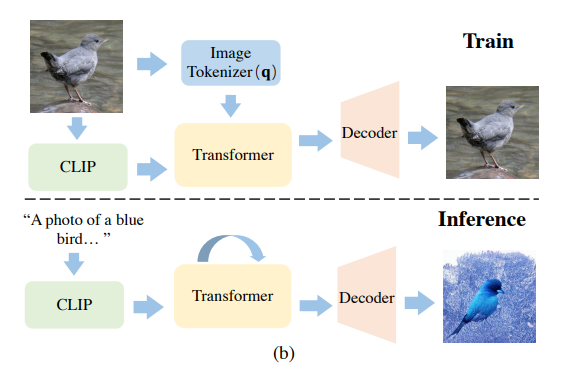
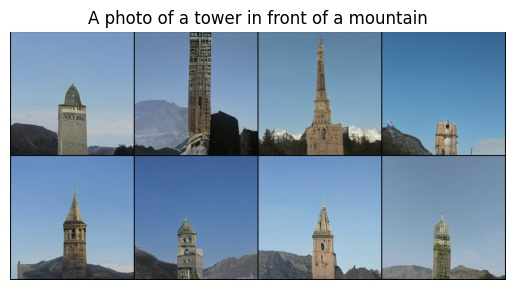
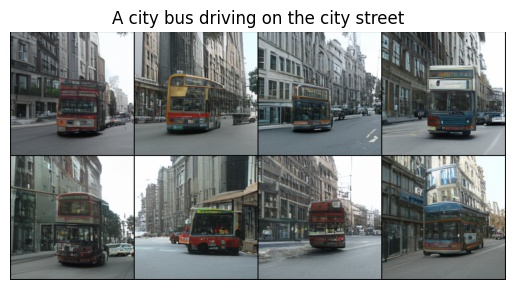
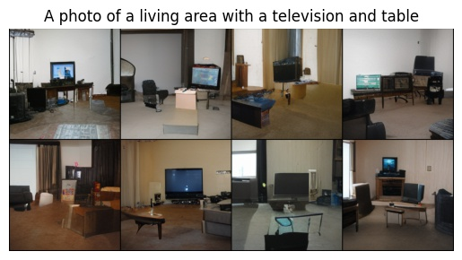
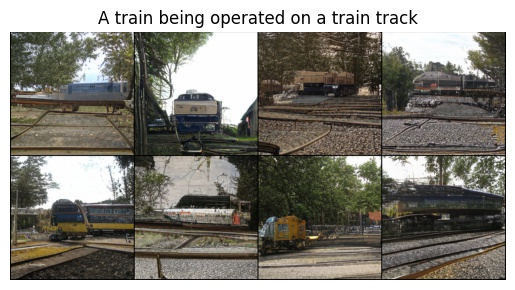
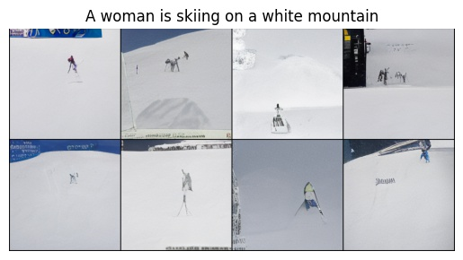

# CLIP-GEN

[简体中文][[English]](README_en.md)

本项目在萤火二号集群上用 PyTorch 实现了论文 《CLIP-GEN: Language-Free Training of a Text-to-Image Generator with CLIP》。



CLIP-GEN 是一个 Language-Free 的文本生成图像的方法，它不依赖图文训练样本，通过预训练 CLIP 模型的强大表征能力，只需要图片数据就可以训练出一个文本生成图像的模型。该方法的基本原理是：CLIP-GEN 首先会训练一个 VQ-GAN，把图片映射到离散空间；然后再训练一个 GPT 模型，把 CLIP embedding 映射到 VQ-GAN 的离散空间；由于在 CLIP 中，文本和图像共享一个特征空间，在 inference 的时候我们就可以通过同样的方法把文本映射到 VQ-GAN 的离散空间，然后 decode 为 RGB 图像。


## Requirements

- [hfai](https://doc.hfai.high-flyer.cn/index.html)
- torch>=1.8

## Training

支持的数据集：`coco`, `imagenet`, `googlecc`

1. 下载 CLIP 预训练模型

    下载 [CLIP](https://github.com/HFAiLab/clip-gen/releases/download/v0.1.0/clip_vit_b32.pt) 后放至 `pretrained/clip_vit_b32.pt`，该预训练模型来自 OpenAI.

2. 在 COCO 上训练 VQGAN

    提交任务至萤火集群：
    ```shell
    hfai python train_vqgan.py --ds coco -- -n 1 -p 30
    ```

    本地运行：
    ```shell
    python train_vqgan.py --ds coco
    ```

3. 在 COCO 上训练 Conditional GPT

    提交任务至萤火集群：
    ```shell
    hfai python train_gpt.py --ds coco --vqgan_ckpt /path/to/vqgan/ckpt -- -n 4 -p 30
    ```

    本地运行：
    ```shell
    python train_gpt.py --ds coco --vqgan_ckpt /path/to/vqgan/ckpt
    ```

## Demo

下载在 COCO 上训练好的 [VQGAN](https://github.com/HFAiLab/clip-gen/releases/download/v0.1.0/vqgan_coco.pt) 和 [GPT](https://github.com/HFAiLab/clip-gen/releases/download/v0.1.0/gpt_coco.pt) 模型，分别放到 `pretrained/vqgan_coco.pt` 和 `pretrained/gpt_coco.pt`；然后运行：

```shell
python demo.py --text "A city bus driving on the city street" --out "bus.jpg"
```

**NOTE**: demo 的运行不依赖 hfai，用户可以在装有 PyTorch 的环境下直接使用

## Samples

下面是一些文本生成图像的样本：







## References

- [taming-transformers](https://github.com/CompVis/taming-transformers)
- [CLIP](https://github.com/openai/CLIP)

## Citation

```
@article{wang2022clip,
  title={CLIP-GEN: Language-Free Training of a Text-to-Image Generator with CLIP},
  author={Wang, Zihao and Liu, Wei and He, Qian and Wu, Xinglong and Yi, Zili},
  journal={arXiv preprint arXiv:2203.00386},
  year={2022}
}
```

## TODO

- [x] 预训练模型
- [ ] FFRecord 数据
