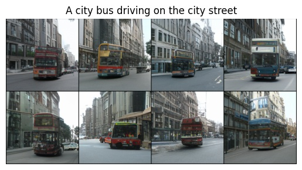

# CLIP-GEN

[English][[简体中文]](README.md)

This is a PyTorch implementation of paper "CLIP-GEN: Language-Free Training of a Text-to-Image Generator with CLIP"


**Abstract**: Training a text-to-image generator in the general domain (e.g., Dall.e, CogView) requires huge amounts of paired text-image data, which is too expensive to collect. In this paper, we propose a self-supervised scheme named as CLIP-GEN for general text-to-image generation with the language-image priors extracted with a pre-trained CLIP model. In our approach, we only require a set of unlabeled images in the general domain to train a text-to-image generator. Specifically, given an image without text labels, we first extract the embedding of the image in the united language-vision embedding space with the image encoder of CLIP. Next, we convert the image into a sequence of discrete tokens in the VQGAN codebook space (the VQGAN model can be trained with the unlabeled image dataset in hand). Finally, we train an autoregressive transformer that maps the image tokens from its unified language-vision representation. Once trained, the transformer can generate coherent image tokens based on the text embedding extracted from the text encoder of CLIP upon an input text. Such a strategy enables us to train a strong and general text-to-image generator with large text-free image dataset such as ImageNet. Qualitative and quantitative evaluations verify that our method significantly outperforms optimization-based text-to-image methods in terms of image quality while not compromising the text-image matching. Our method can even achieve comparable performance as flagship supervised models like CogView.


## Requirements

- hfai (to be released soon)
- torch>=1.8

## Training

Supported datasets：`coco`, `imagenet`, `googlecc`

1. Download pretrained CLIP model

    Download [CLIP](https://github.com/HFAiLab/clip-gen/releases/download/v0.1.0/clip_vit_b32.pt) to `pretrained/clip_vit_b32.pt`

2. train VQGAN on COCO

    ```shell
    python train_vqgan.py --ds coco
    ```

3. train Conditional GPT on COCO

    ```shell
    python train_gpt.py --ds coco --vqgan_ckpt /path/to/vqgan/ckpt
    ```

## Demo

Download [VQGAN](https://github.com/HFAiLab/clip-gen/releases/download/v0.1.0/vqgan_coco.pt) and [GPT](https://github.com/HFAiLab/clip-gen/releases/download/v0.1.0/gpt_coco.pt) model (trained on COCO) to `pretrained/vqgan_coco.pt` and `pretrained/gpt_coco.pt` respectively. And run:

```shell
python demo.py --text "A city bus driving on the city street" --out "bus.jpg"
```

**NOTE**: This demo could run without hfai package.

## Samples





## References

- [taming-transformers](https://github.com/CompVis/taming-transformers)
- [CLIP](https://github.com/openai/CLIP)

## Citation

```
@article{wang2022clip,
  title={CLIP-GEN: Language-Free Training of a Text-to-Image Generator with CLIP},
  author={Wang, Zihao and Liu, Wei and He, Qian and Wu, Xinglong and Yi, Zili},
  journal={arXiv preprint arXiv:2203.00386},
  year={2022}
}
```

## TODO

- [x] pretrained models
- [ ] FFRecord data
